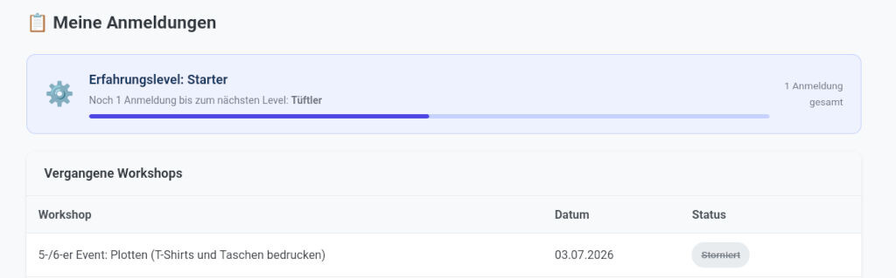
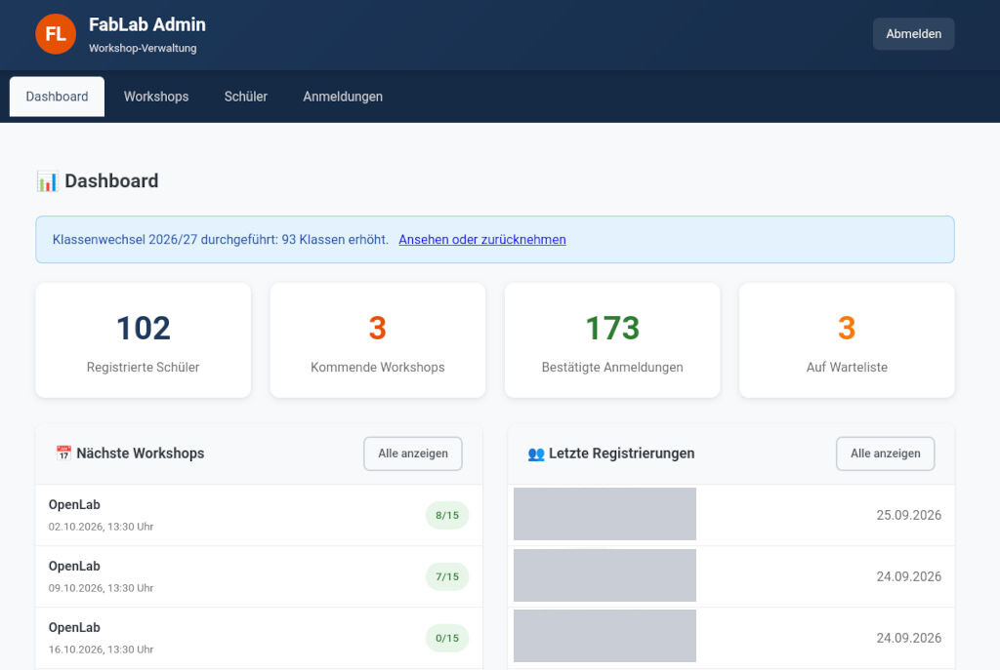
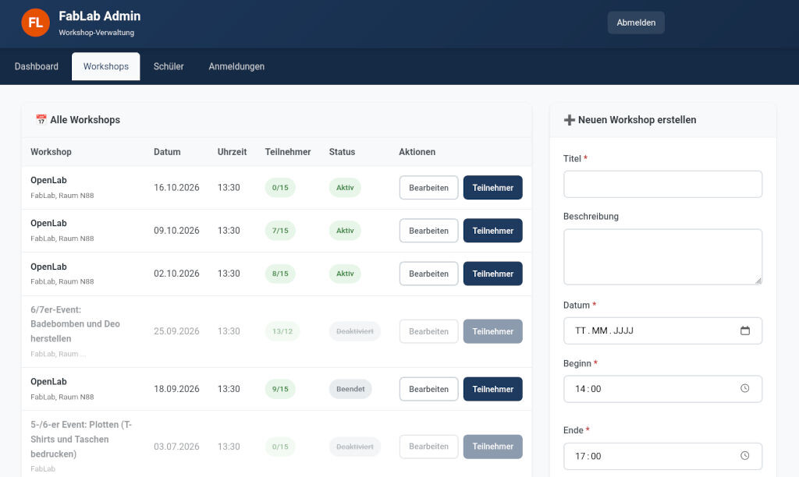
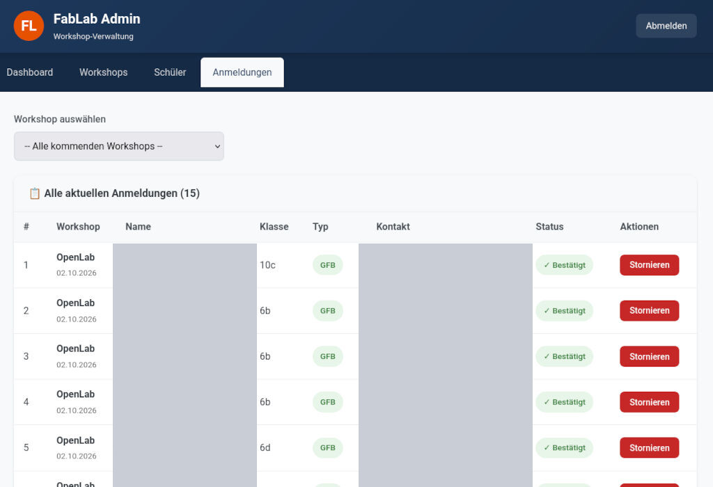
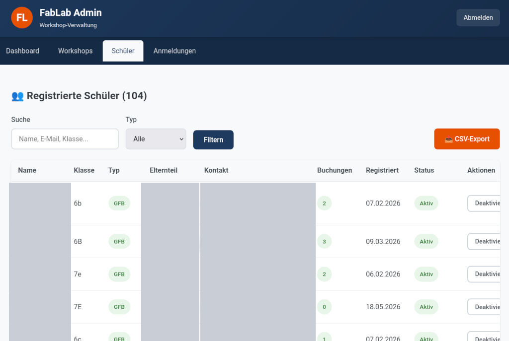
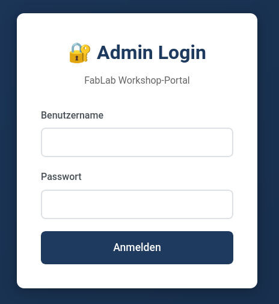

# FabLab Workshop-Portal

Ein schlankes Anmeldesystem für Schul-Workshops, entstanden für das FabLab des
Gymnasiums in den Filder Benden. Schülerinnen und Schüler melden sich selbst zu
Workshops an, die Verwaltung pflegt Termine und Teilnehmerlisten über einen
Adminbereich.

PHP und MySQL, kein Framework, keine externen Pakete, kein Build-Schritt. Läuft
auf jedem gewöhnlichen Webspace.

## Was es kann

**Für Schülerinnen und Schüler**
- einmalige Registrierung mit Einwilligung, Elternkontakt und Notfallnummer
- Anmeldung ohne Passwort: per Zahlencode an die E-Mail-Adresse oder per
  persönlichem Zugangslink
- Workshops mit einem Klick buchen, mit automatischer Warteliste
- eigene Anmeldungen stornieren, die Warteliste rückt automatisch nach
- spielerische Erfahrungsstufen von „Starter“ bis „FabLab-Legende“

**Für die Verwaltung**
- Workshops anlegen, bearbeiten, stilllegen und löschen
- Teilnehmerlisten mit Notfallnummern als CSV herunterladen
- Personen von Hand hinzufügen oder von der Warteliste nachrücken lassen
- Obergrenze für die Klassen 5 und 6 je Workshop
- jährlicher Klassenwechsel mit Vorschau, Protokoll und Rücknahme

**Regeln, die das System durchsetzt:** Platz- und Wartelistengröße je Workshop,
höchstens zwei offene Buchungen pro Person (einstellbar).

Die vollständige Beschreibung mit allen Regeln und bekannten Grenzen steht in
[FUNKTIONSBESCHREIBUNG.md](FUNKTIONSBESCHREIBUNG.md).

## So sieht es aus

Personenbezogene Daten sind in allen Bildern geschwärzt.

**Eigene Anmeldungen mit Erfahrungsstufe** – die Sicht der Schülerinnen und Schüler



**Dashboard** – Kennzahlen, nächste Workshops, neue Registrierungen und der
Hinweis auf den Klassenwechsel



**Workshops verwalten** – Termine anlegen, bearbeiten, stilllegen



**Anmeldungen** – Teilnehmerlisten je Workshop, stornieren, nachrücken lassen,
CSV-Export



**Schülerinnen und Schüler** – alle Registrierten mit Klasse, Kontakt und Buchungen



**Admin-Login**



## Voraussetzungen

- PHP 8.0 oder neuer mit PDO-MySQL
- MySQL oder MariaDB
- HTTPS (die Sitzungs-Cookies werden nur verschlüsselt übertragen)
- ein Webserver, der E-Mails über die PHP-Funktion `mail()` verschicken kann

## Installation

1. **Datenbank anlegen.** Im Hosting-Panel eine MySQL-Datenbank und einen
   Benutzer mit allen Rechten darauf einrichten.

2. **Konfiguration.** `includes/config.example.php` nach `includes/config.php`
   kopieren und die mit `ANPASSEN` markierten Werte eintragen. Für das
   Admin-Passwort wird nur der Hash hinterlegt:
   ```
   php -r "echo password_hash('DEIN_PASSWORT', PASSWORD_DEFAULT), PHP_EOL;"
   ```
   `config.php` enthält Zugangsdaten und gehört nie in die Versionsverwaltung.

3. **Tabellen anlegen.** Die Tabellendefinitionen stehen in
   `includes/Database.php` in der Methode `createTables()`. Diese entweder
   einmalig über ein kurzes eigenes Skript aufrufen (und das Skript danach
   löschen) oder die `CREATE TABLE`-Anweisungen in phpMyAdmin ausführen.
   Danach diese drei Spalten ergänzen:
   ```sql
   ALTER TABLE workshops ADD COLUMN max_5_6_klasse INT NULL AFTER max_warteliste;
   ALTER TABLE schueler  ADD COLUMN otp_code VARCHAR(255) NULL AFTER token;
   ALTER TABLE schueler  ADD COLUMN otp_expires_at DATETIME NULL AFTER otp_code;
   ```
   Die Tabelle `fehlversuche` legt das System beim ersten Gebrauch selbst an.

4. **Dateien hochladen**, z.B. per FTP nach `/fablab/`. Der Ordner `tests/`
   wird auf dem Server nicht gebraucht.

5. **Aufrufen:** Das Portal liegt unter `https://deine-schule.de/fablab/`,
   der Adminbereich unter `…/fablab/admin/`.

## Tests

```
php tests/test_sicherheit.php
```

Prüft Anmeldesperren, Ablauf der Zugangslinks und den CSV-Export gegen eine
SQLite-Datenbank im Speicher. Eine MySQL-Verbindung ist dafür nicht nötig.

## Sicherheitslücken melden

Bitte nicht als öffentliches Issue, sondern vertraulich über
**Security → Report a vulnerability** in diesem Repository.

## Lizenz

MIT, siehe [LICENSE](LICENSE).
